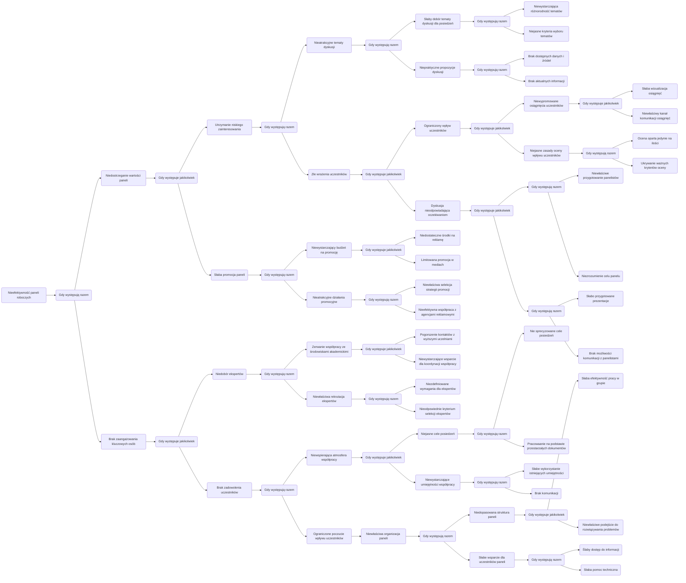

# AcyclicLogicalDirectedGraph
class AcyclicLogicalDirectedGraph (js)


## Example mermaid graph 



How to use class:
```javascript
let mermaid = `graph LR
  N(Nieefektywność paneli roboczych) --> AND1(Gdy występują razem)
  AND1 --> Z1(Niedostrzeganie wartości paneli)
  AND1 --> Z2(Brak zaangażowania kluczowych osób)
  Z1 --> OR1(Gdy występuje jakikolwiek)
  ...
`;

let graph = AcyclicLogicalDirectedGraph.fromMermaid(mermaid);
console.log(graph.calculateVertexSmartDepthMap()); // Show the strength (depth) of logically dependent vertexes 
//...

console.log(graph.toMermaid()); // Convert instance of AcyclicLogicalDirectedGraph to mermaid string
```
